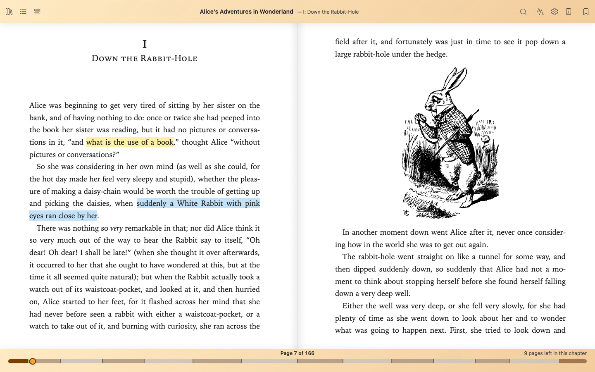

# Ambra - the best of EPUB books, right in your browser

> This source guide describes the unreleased interface. The public website's guide remains pinned to the released version. Existing screenshots may show the previous interface; follow the control names in the text below.

Ambra brings a personal EPUB library and an integrated EPUB Inspector to Chrome. For readers, it is a place to make books your own: adjust the reading experience, find passages, and keep your notes. For EPUB authors and publishers, it connects the book you see with the files behind it—making investigation and debugging easier without leaving the reader.

**Here to explore how a book is built?** Meet the [EPUB Inspector](epub-inspector.md): source and content inspection, reading-to-source navigation, and reference finding in one place.

> **Reading with a screen reader?** For continuous reading in a reflowable book, consider scrolling mode: **Alt+Shift+Page Down** (**Option+Shift+Page Down** on Mac). Return to pagination: **Alt+Shift+Page Up** (**Option+Shift+Page Up** on Mac).
>
> Mac laptops may require **Fn+Down/Up** for Page Down/Up, together with the other shortcut keys. Fixed-layout books keep their fixed layout.

## More room for reading

- **A library on your device.** Import saved EPUBs, keep books together, and browse the [Library panel](ambra-library.md#browse-your-library-while-reading) without leaving your current book.
- **A reading style that suits you.** Use shared **Ambra settings** for interface and reading preferences, and **Book options** for the current book's typography and layout. Fixed-layout books retain the publisher’s page design.
- **Read wide tables without changing the page.** Use **Expand table** to open a separate [table viewer](table-viewer.md) with zoom and two-way scrolling.
- **Find your way.** **Contents** comes first in the reader toolbar, followed by **Library**. Use [book navigation](book-navigation.md), search, and the wide progress bar with clickable bookmarks to reach the passages that matter.
- **Keep your thinking alongside the text.** Highlight passages, add notes, and revisit them in the right-side [Annotations panel](annotations-and-bookmarks.md).
- **Read along when the book includes narration.** [Read along](read-along-books.md) controls appear automatically, initially paused, for supported recorded narration.

See [Reading tips](reading-tips.md) for appearance, layout, images, and popup notes.

## Keyboard shortcuts

**Mod** means **Command** on Mac and **Control** elsewhere; **Alt** is **Option** on Mac.

| Action | Default shortcut |
| --- | --- |
| Previous / next page | Page Up / Page Down; Shift+Space / Space |
| Move left / right in the book’s reading direction | Left / Right |
| Previous / next section | Alt+Page Up / Alt+Page Down |
| Go to page / percentage | Mod+G / Mod+Shift+G |
| Search the book | Mod+F |
| Toggle a bookmark | Mod+B |
| Select scrolling / pagination | Alt+Shift+Page Down / Alt+Shift+Page Up |
| Show keyboard shortcuts | Mod+/ |

In scrolling mode, Page keys and Space scroll normally; Left/Right move between sections. Text fields and dialogs keep their own keys; browser or assistive-technology shortcuts may take priority.
