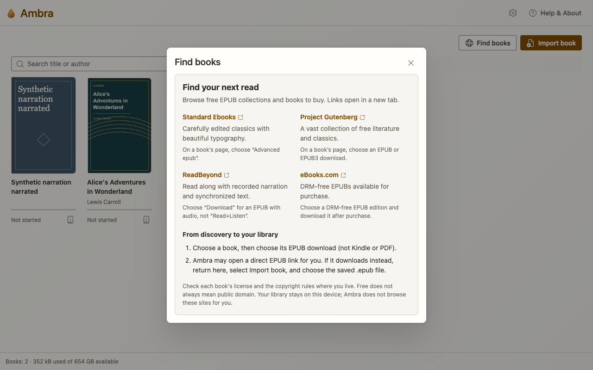

# Ambra Library

Your EPUB books, together in Chrome.

## Open your Library

- **From Chrome:** click the **Extensions** button (the puzzle-piece icon)
  beside the address bar and choose **Ambra EPUB Reader**. Pin Ambra there
  if you'd like to open it directly from Chrome's toolbar.
- **While reading:** reveal the reader toolbar and click **Library**, next
  to **Contents**.

For more room, choose **Open library in new tab**.

## Add a book from your device

Choose **Import book** and select your EPUB files. If an import window opens,
choose **Choose EPUB files...**.

**Tip:** select several books at once, or drag EPUB files into the Library
tab or import window.

## Find new books on the web

Choose **Find books** for links to places to get EPUBs:

- **Standard Ebooks:** choose **Advanced epub** for carefully formatted classics.
- **Project Gutenberg:** choose an **EPUB** or **EPUB3** download.
- **ReadBeyond:** choose **Download** for a [read-along book](read-along-books.md)
  with recorded narration, rather than the browser-based **Read+Listen** option.
- **[eBooks.com](https://www.ebooks.com/drm-free-epub):** look for a DRM-free EPUB
  edition to buy and download.

Ambra can add EPUB downloads directly to your Library. If a download doesn't
import automatically, save the file to your device and use **Import book**.

## A few book-finding tips

- Choose **EPUB**, not PDF or Kindle formats.
- Check for **DRM-free** before buying; Ambra cannot open DRM-protected books.
- Importing the same EPUB again shows **Already in your library** without
  replacing your reading position or notes.
- Keep your original EPUB files as backups. Your Library is stored in your
  Chrome profile, not synced to a cloud account.

## Check book details

Open **Book details** for a description and **Publication details** for
rights and accessibility information. Choose **EPUB Inspector** to
[explore the book's source, files, and metadata](epub-inspector.md).

**Remove from library** is at the bottom of Book details. Removing a book
also removes its saved reading position and annotations, but leaves the
original EPUB on your device unchanged.

[Back to the Ambra guide](README.md)
