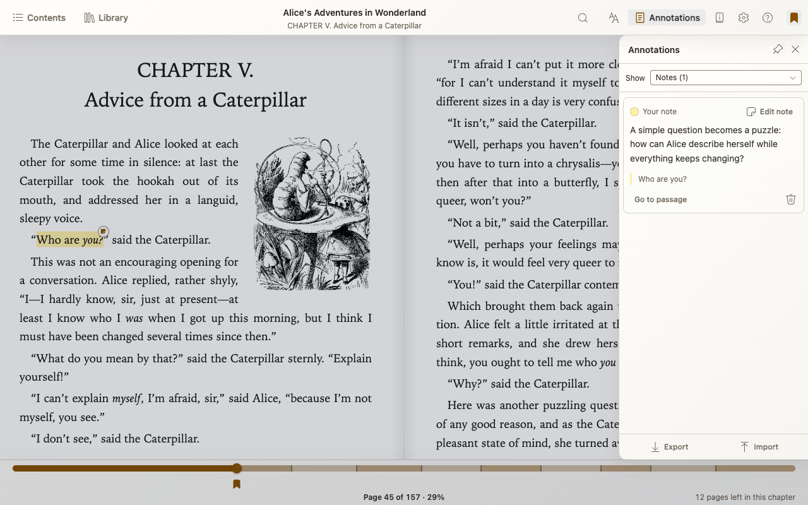

# Annotations and Bookmarks

Choose **Annotations** in the reader toolbar to open the right-side **Annotations panel**.
The **Show** dropdown offers **All annotations**, **Highlights**, **Notes**, and
**Bookmarks**, with counts. **Notes** filters to highlights with notes.
Search and Book details replace Annotations on the right. Pin Annotations to
keep it open when you open Contents or Library on the left. Likewise, opening
Annotations keeps a pinned Contents panel open. When space is tight, Ambra
temporarily shows the active panel without forgetting the other panel's pin
preference or your drafts.

## Save and revisit a bookmark

Use the reader toolbar’s bookmark button, or **Mod+B**, to add or remove a bookmark at your current position. **Mod** means Command on Mac and Control elsewhere.

Choose **Annotations → Show → Bookmarks** to revisit or remove saved places.
Page numbers update with your reading layout. Theme-colored flags on the
[progress bar](book-navigation.md#move-along-the-progress-bar) also open saved
locations directly, or offer a chooser when bookmarks are close together.
**Show all bookmarks** from that chooser temporarily selects the Bookmarks
filter; reopening Annotations from the toolbar restores your last manual filter.

Bookmarks supplied with the book have a **Publisher note** tag and cannot be deleted.

## Highlight text and add a note

1. Select a passage in the book.
2. Choose a highlight color or underline in the selection toolbar. Choose **Add note** to create a highlight and start a note together.
3. Write your note and choose **Save**, or **Cancel** to dismiss your edits.

Open a highlight to edit or delete it, or choose **Annotations → Show → Highlights**
or **Notes**. A note appears above its quoted passage; **Go to passage** returns
to that location. Switching filters or temporarily closing the panel does not
discard an unsaved note draft, but choose **Save** before leaving the reader.

Changing the interface theme does not change your saved highlight colors.

## Export or import annotations

Use **Export** in **Annotations** to save highlights, notes, bookmarks, and labels as an **EPUB Annotations 1.0 JSON file**.

To bring annotations into a book, choose **Import** and select a compatible JSON file. Use the same book or edition for best results. Unsupported locations and detected duplicates are skipped; compatibility varies between tools.

[Back to the Ambra guide](README.md)
