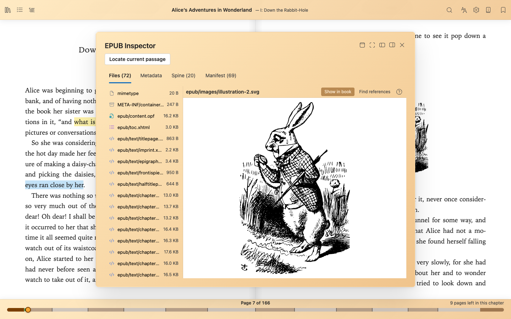
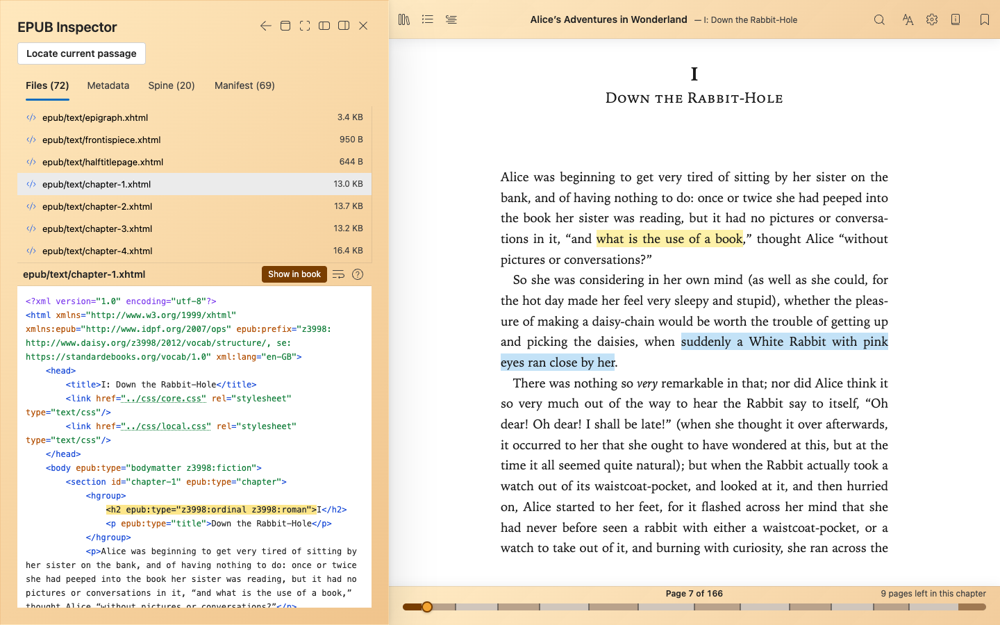

# EPUB Inspector — from the page to the source

Explore the files, images, and metadata inside an EPUB without unpacking it. For authors and publishers, EPUB Inspector connects what you see on the page with the source behind it.

## Open EPUB Inspector

- **In the reader:** move to the top edge to reveal the toolbar. Click the book title or the book-shaped information icon beside **Settings**.
- **In the Library:** hover over a book’s cover and click the information button in its upper-left corner.

Both open **Book details**. Choose **EPUB Inspector** near the bottom of that panel; scroll down if needed.

## See the whole book

- **Files:** browse the EPUB’s contents and preview images, audio, and video.
- **Source:** read syntax-highlighted markup and stylesheets, and follow links between files.
- **Metadata, Spine, and Manifest:** inspect publication details, reading order, and the resource inventory.

## Connect reading and source

Use **Dock left** or **Dock right**, beside the Close button, to inspect source alongside the book. **Popover view** and **Full screen** are also available.

When Inspector is opened from the reader:

- **Locate current passage** finds the source for your selection or current reading position.
- **Show in book** takes you from a source element back to its reading location.

Move between a passage and its markup without leaving the book.

## Follow a resource’s references

For an image or stylesheet, choose **Find references** to see where the book uses it. Open a result to inspect that source location.

This answers questions such as “Which pages use this image?” and “Where is this stylesheet linked?”

## Investigate without changing the book

Inspector is **read-only**: your EPUB remains unchanged. It is not an editor or a replacement for EPUBCheck or an accessibility audit. Reference finding covers supported static markup and CSS, not dynamically computed JavaScript uses.

Screenshots show Lewis Carroll’s *Alice’s Adventures in Wonderland*, illustrated by John Tenniel, in the [Standard Ebooks edition](https://standardebooks.org/ebooks/lewis-carroll/alices-adventures-in-wonderland/john-tenniel). Its [rights statement](https://standardebooks.org/ebooks/lewis-carroll/alices-adventures-in-wonderland/john-tenniel/text/uncopyright) identifies the original text and artwork as believed to be in the US public domain, with Standard Ebooks editorial contributions dedicated to CC0.

[Report Issues / Request Features](report-issues.md) · [Back to the Ambra guide](README.md) · [Source](https://github.com/BCWalters/ambra)
