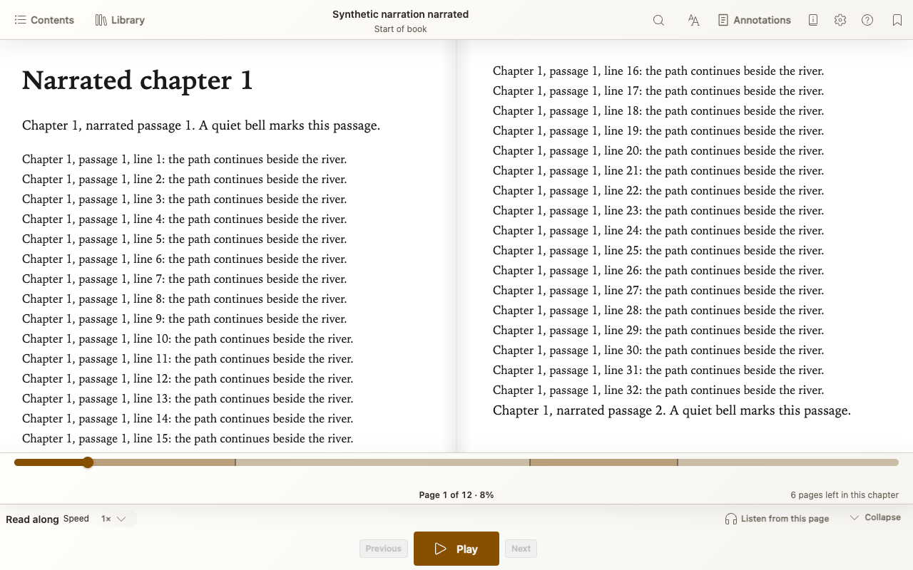
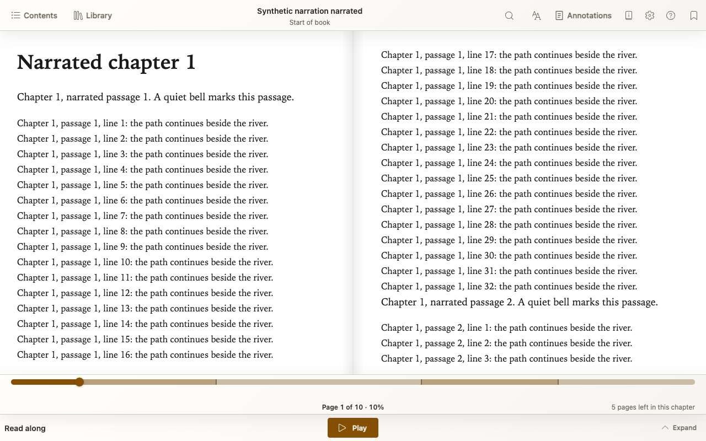

# Read-along books

Listen to recorded narration while Ambra highlights the passage being read and follows along through the book.

## How it works

Read-along EPUBs use **EPUB Media Overlays**: the book includes audio recordings and timing information that links each audio passage to its text. Ambra uses those links to keep narration and reading in step.

This is narration supplied with the EPUB, not automatic text-to-speech. The book needs to include Media Overlays for these controls to appear.

## Start listening

Open a book with recorded narration. **Read along** controls appear
automatically at the bottom of the reader. Choose **Play** to start listening.

- Use **Speed** to listen faster or slower.
- Choose **Listen from this page** to start at your reading position, or
  select text and choose **Listen from selection**.
- Browsed away while listening? **Return to narration** takes you back to
  the passage being read.

## Make more room without stopping playback

Choose **Collapse** for smaller controls without pausing narration.
**Expand** brings the full controls back.

## Find a read-along book

Try [ReadBeyond](https://www.readbeyond.it/ebooks.html), also available through
**Find books** in your Library. Choose **Download** for a read-along EPUB,
not the browser-based **Read+Listen** option.

[Back to the Ambra guide](README.md)
